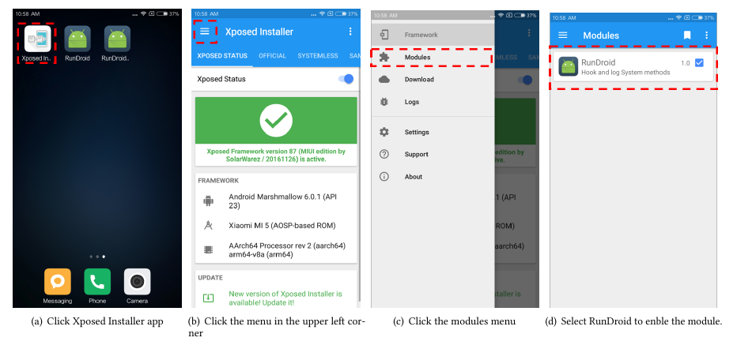

# README

# The Overview of Project

## The prepare work

Please make sure that the build computer meets the following conditions:
- JDK 1.8.+
- Maven
- Android Studio
- Neo4j Database
   And, please make sure that the phone support Xposed.

## Build the jar file
You can download the source code from https://github.com/MiJack/RunDroid using Git.The project can be built by Maven:
- Enter the foldler *unit* and install the util model using `mvn clean install`.
- Enter the folder *SourceInstrumt* and build the jar for SourceInstrument using `mvn clean package`.
- Enter the folder *LogcatModel* and build the jar for LogcatModel using `mvn clean package`.
  \end{enumerate}
  After these steps above, you can find the jar files `SourceInstrumt.jar`, `LogcatModel.jar` in corresponding `target` folder.


# Instrument Source Code

Using the commend below, you can instrument the log code in Android Project. For example, if you want to instrument in `folder\path\to\Project\src` and the output file should be the same folder, you should replace the`<path to the input java files >`and `<path to the output java files >`  to `\path\to\Project\src`. 

```bash
$ java -jar <path to SourceInstrumt jar file> \
     -java-input  <path to the input java files> \
     -java-output <path to the output java files>
```

#  Build the Xposed Module and the Demo Application

The code for the Xposed module and the demo application can be found in the website mentioned before. You can build Xposed module and demo application using Android Studio or Gradle. When you build the project, you will get two apk files.  Because the log needs the class XLog, you should add the gradle modle dependency into the project or copy the files to the demo project.  Check whether your Android phone supports Xposed, before you install these two applications. After installing Xposed module, please make the module enable in Xposed Installer application following  the figure below. Then, the module will work after rebooting the phone.



# Turn On the Logging for the Demo Application

The Xposed module will not log the information about the method executions unless you turn on the logging for the target applications using the following two steps:

- Push the *android.mlf* to the phone using the command below. You can find the file `android.mlf`, which defines the method signatures of the framework methods we want to capture. If you want to capture some new methods, you can add the new method signatures to this file. 
- Push the switch file for the demo application to the sdcard. For example, for the Demo application, since the package name of the Demo class is `cn.mijack.multithreadandipcdemo`, you should push the file `cn.mijack.multithreadandipcdemo.mlf` to the sdcard.

```bash
$ adb push <path to push file> /sdcard
```

**Note:** To allow Xposed to work properly, you should grant the permission `android.permission.WRITE_EXTERNAL_STORAGE` for the instrumented app before running the app.

# Run Application and Collect the Log
With the configurations set up from the previous steps, you can run the target app.  When the app is running, you can see the log outputs in the logcat provided by Android Studio. You can redirect the log outputs to a text file by selecting the log tag **XLog**.  The next step we can build a call graph using the log file.


# Build call graph
To build the call graph, we need four files as input.


- The apk file: you can find this file in the Android project.
- The AndroidManifest file: the file defines the Activity components in the app.
- The log file: you can find this file in **Run Application and Collect the Log**.
- The *android.jar* folder: the path to the folder *platform* in Android SDK.


```bash
$ java -jar <path to LogcatModel jar file> \
     -logFile <path to log files> \
     -manifestFile <path to AndroidManifest.xml> \    
     -androidJar <path to the folder of Android.jar as the parameter of  Soot> \
     -apkFile <path to apk file>
```

After the commands executed, you can find a new folder named by the log file's name. 
It's a Neo4j database folder. You can open it using Neo4j.